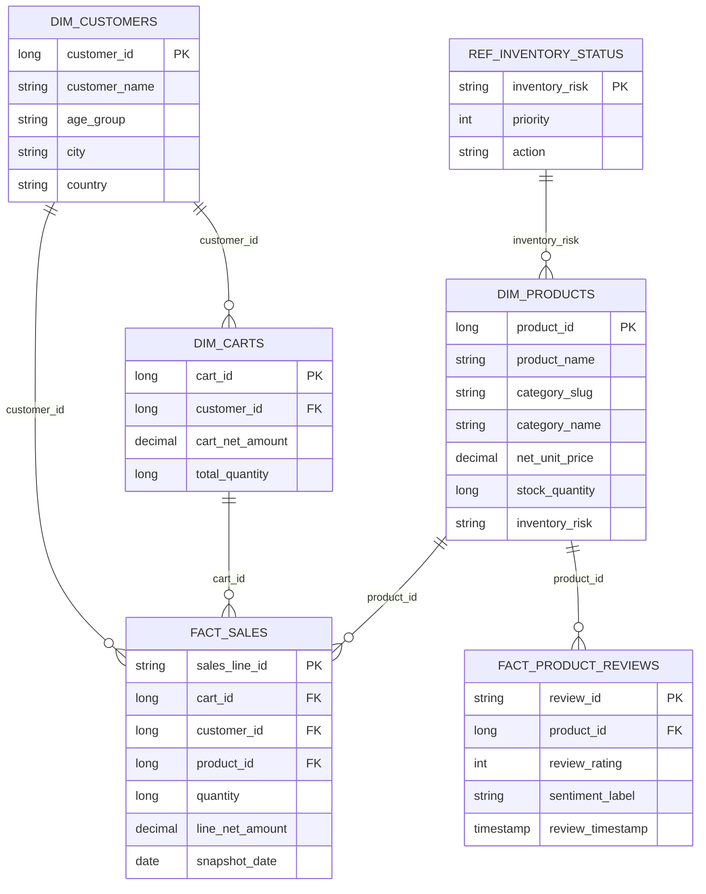
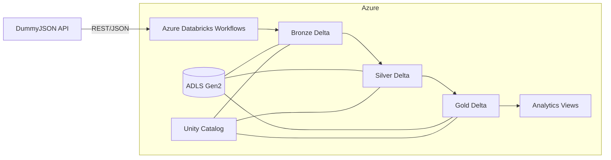
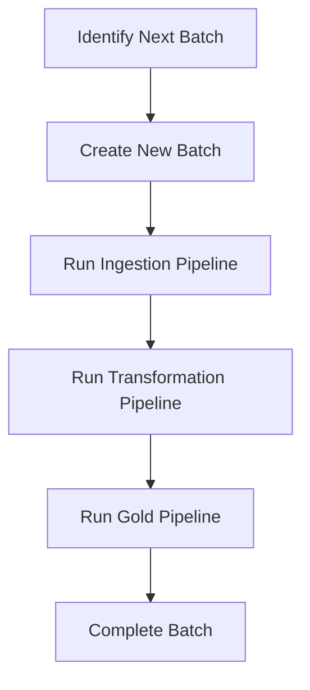

# TÀI LIỆU DỰ ÁN E-COMMERCE DATA ENGINEERING

> **DummyJSON E-Commerce Incremental Lakehouse**  
> Pipeline dữ liệu thương mại điện tử end-to-end trên Azure Databricks, sử dụng Azure Data Lake Storage Gen2, Unity Catalog, Apache Spark và Delta Lake theo kiến trúc Medallion.

## Mục lục

- [Chương I. Design](#chương-i-design)
- [Chương II. Plan and Implement](#chương-ii-plan-and-implement)
- [Phụ lục](#phụ-lục)

# Chương I. Design

## A. Data Source là gì?

Dự án sử dụng API công khai [DummyJSON](https://dummyjson.com/) làm nguồn dữ liệu mô phỏng cho một hệ thống thương mại điện tử. API không yêu cầu API key trong cấu hình hiện tại.

| Dataset | Endpoint | Mục đích |
|---|---|---|
| Products | `/products?limit=0` | Thông tin sản phẩm, giá, tồn kho, danh mục và review lồng trong sản phẩm. |
| Product Categories | `/products/categories` | Danh mục và tên hiển thị của danh mục sản phẩm. |
| Users | `/users?limit=0` | Hồ sơ khách hàng, địa chỉ và thông tin công việc. |
| Carts | `/carts?limit=0` | Giỏ hàng, khách hàng và các dòng sản phẩm trong giỏ. |

Từ payload gốc, pipeline tiếp tục tách hai dataset con:

- `cart_items` từ mảng `products` trong từng cart;
- `product_reviews` từ mảng `reviews` trong từng product.

Base URL mặc định là `https://dummyjson.com`, được khai báo tại `00-common/01.environment-config.py`.

## B. Dữ liệu trả về từ API là gì?

DummyJSON trả payload JSON có cấu trúc lồng nhau. Bronze giữ dữ liệu gần với nguồn và bổ sung metadata phục vụ lineage:

```json
{
  "id": 1,
  "title": "Essence Mascara Lash Princess",
  "category": "beauty",
  "price": 9.99,
  "discountPercentage": 7.17,
  "rating": 4.94,
  "stock": 5,
  "reviews": [
    {
      "rating": 2,
      "comment": "Very unhappy with my purchase!",
      "date": "2024-05-23T08:56:21.618Z",
      "reviewerName": "John Doe",
      "reviewerEmail": "john.doe@example.com"
    }
  ],
  "ingestion_timestamp": "<UTC timestamp>",
  "source_api": "https://dummyjson.com/products?limit=0",
  "dataset_name": "products",
  "batch_id": "20260722103000"
}
```

Các nhóm dữ liệu chính sau chuẩn hóa:

| Nhóm | Trường tiêu biểu |
|---|---|
| Product | `product_id`, `product_name`, `category_slug`, `brand_name`, `sku`, `list_price`, `discount_pct`, `net_unit_price`, `rating`, `stock_quantity`, `inventory_risk` |
| Customer | `customer_id`, `customer_name`, `email`, `gender`, `age_group`, `city`, `country`, `company_name`, `job_title` |
| Cart | `cart_id`, `customer_id`, `cart_gross_amount`, `cart_net_amount`, `cart_discount_amount`, `total_products`, `total_quantity` |
| Cart item | `cart_id`, `product_id`, `quantity`, `unit_price`, `line_gross_amount`, `line_discount_amount`, `line_net_amount` |
| Review | `product_id`, `review_rating`, `sentiment_label`, `review_timestamp`, `reviewer_name`, `reviewer_email` |

## C. Cơ chế xử lý incremental

Mỗi lần chạy được gắn một `batch_id` theo định dạng `yyyyMMddHHmmss`. Workflow truyền cùng `batch_id` xuyên suốt Bronze, Silver và Gold.

- **Bronze:** ghi Delta theo partition `batch_id`; dùng `replaceWhere` để chạy lại cùng batch mà không tạo dữ liệu trùng.
- **Silver:** chỉ đọc partition của batch hiện tại, chuẩn hóa schema và `MERGE` theo business key. Bản ghi chỉ được cập nhật khi batch nguồn mới hơn hoặc bằng batch đã có.
- **Gold:** chỉ xử lý dữ liệu Silver của batch hiện tại và `MERGE` vào dimension/fact theo khóa nghiệp vụ.
- **Control:** bảng `ecommerce_incr.control.batch_control` theo dõi trạng thái `in_progress` và `completed`. Batch chưa hoàn tất sẽ được workflow ưu tiên chạy lại.

Thiết kế này giúp pipeline có tính idempotent: retry cùng một batch không tạo duplicate logic.

## D. Phạm vi dữ liệu

Dự án tập trung vào dữ liệu vận hành và phân tích thương mại điện tử:

1. Doanh thu và mức chiết khấu theo sản phẩm, danh mục và thương hiệu.
2. Giá trị khách hàng dựa trên số giỏ hàng, số lượng mua và doanh thu.
3. Rủi ro tồn kho và mức độ ưu tiên bổ sung hàng.
4. Chất lượng sản phẩm dựa trên rating và sentiment của review.

DummyJSON là nguồn dữ liệu mô phỏng. Vì endpoint hiện được gọi với `limit=0`, mỗi batch lấy toàn bộ dữ liệu nguồn khả dụng rồi thực hiện upsert ở các lớp sau. Với production, có thể thay bằng API hỗ trợ watermark, CDC hoặc phân trang incremental.

## E. Các bài toán nghiệp vụ

### Business Requirement #1 — Phân tích doanh thu

- Theo dõi gross revenue, net revenue và discount amount.
- So sánh doanh thu, số lượng bán và số giỏ hàng theo danh mục.
- Tính revenue per cart và effective discount percentage.

### Business Requirement #2 — Phân khúc giá trị khách hàng

- Tổng hợp số giỏ hàng, sản phẩm khác nhau, số lượng mua và average order value.
- Phân nhóm khách hàng thành `VIP`, `GROWTH`, `STANDARD` và `NO_PURCHASE`.
- Hỗ trợ phân tích theo giới tính, nhóm tuổi và địa lý.

### Business Requirement #3 — Quản trị tồn kho

- Kết hợp tồn kho hiện tại với lượng bán và doanh thu.
- Gắn mức độ rủi ro tồn kho và ưu tiên replenishment.
- Đề xuất hành động cho từng trạng thái tồn kho.

### Business Requirement #4 — Theo dõi chất lượng sản phẩm

- Tổng hợp số review, điểm trung bình và phân bố sentiment.
- Phân loại trạng thái `HEALTHY`, `WATCH`, `QUALITY_RISK` hoặc `NO_REVIEWS`.
- Xác định sản phẩm cần theo dõi chất lượng.

## F. Mô hình dữ liệu

### Grain và khóa merge chính

| Table | Grain | Khóa merge |
|---|---|---|
| `dim_products` | Một sản phẩm | `product_id` |
| `dim_customers` | Một khách hàng | `customer_id` |
| `dim_carts` | Một giỏ hàng | `cart_id` |
| `fact_sales` | Một sản phẩm trong một giỏ hàng | `sales_line_id = cart_id-product_id` |
| `fact_product_reviews` | Một review sản phẩm | SHA-256 của `product_id`, `reviewer_email`, `review_timestamp` |
| `ref_inventory_status` | Một mức rủi ro tồn kho | `inventory_risk` |

### Mô hình quan hệ logic



Đây là quan hệ phân tích logic; các foreign key không được khai báo vật lý trong Delta Lake.

## G. Thiết kế hệ thống ELT

### Kiến trúc tổng thể



### Vai trò từng lớp

| Layer | Vai trò | Đối tượng chính |
|---|---|---|
| Landing | External Volume trên ADLS Gen2, sẵn sàng cho file-based ingestion | `ecommerce_incr.landing.files` |
| Bronze | Dữ liệu gần nguồn, metadata ingestion, partition theo batch | products, categories, users, carts, cart items, reviews |
| Silver | Chuẩn hóa tên cột, kiểu dữ liệu, trường dẫn xuất và upsert | products, product_categories, customers, carts, cart_items, product_reviews |
| Gold | Dimension, fact và reference phục vụ BI | 3 dimensions, 2 facts, 1 reference |
| Analytics | View tổng hợp theo use case nghiệp vụ | 4 analytical views |
| Control | Theo dõi vòng đời batch | `batch_control` |

# Chương II. Plan and Implement

## A. Công nghệ sử dụng

| Thành phần | Công nghệ |
|---|---|
| Compute & Orchestration | Azure Databricks, Databricks Workflows |
| Processing | Apache Spark / PySpark |
| Storage | Azure Data Lake Storage Gen2 |
| Table format | Delta Lake |
| Governance | Unity Catalog |
| Transform & serving | Databricks notebooks, Spark SQL, SQL views |
| Data source | DummyJSON REST API |

## B. Cấu trúc repository

```text
sport-project/
├── 00-common/          # Config, schema và helper dùng chung
├── 01-setup/           # Tạo external location, catalog, schema, volume
├── 02-bronze/          # Ingest API và tách nested datasets
├── 03-silver/          # Chuẩn hóa và merge dữ liệu
├── 04-gold/            # Xây dựng dimensions, facts, reference
├── 05-analytics/       # Các SQL view phục vụ phân tích
├── 06-orchestration/   # Batch control và workflow notebooks
└── docs/               # Tài liệu vận hành workflow
```

## C. Luồng Databricks Workflow

Workflow được cấu hình thành chuỗi phase tuyến tính:



Trong từng phase, các notebook độc lập chạy song song:

- Bronze gọi đồng thời Products, Categories, Users và Carts; Cart Items chờ Carts, Product Reviews chờ Products.
- Silver chạy đồng thời sáu transformation.
- Gold chạy đồng thời ba dimension; Sales Fact chờ Product và Cart Dimension, Product Review Fact chờ Product Dimension.
- Nếu notebook con thất bại, lỗi được truyền lên phase task và workflow không chuyển sang phase tiếp theo.

### Ảnh pipeline Azure Databricks

> **PLACEHOLDER — Databricks Workflow**  
> Thay phần này bằng ảnh chụp DAG/Jobs & Pipelines sau khi upload.

<!-- Ví dụ:  -->

## D. Các bảng và view đầu ra

### Gold tables

| Object | Mục đích |
|---|---|
| `ecommerce_incr.gold.dim_products` | Thuộc tính sản phẩm, danh mục, giá và tồn kho. |
| `ecommerce_incr.gold.dim_customers` | Hồ sơ và thuộc tính phân tích khách hàng. |
| `ecommerce_incr.gold.dim_carts` | Tổng quan từng giỏ hàng. |
| `ecommerce_incr.gold.fact_sales` | Chỉ số bán hàng ở cấp cart-product. |
| `ecommerce_incr.gold.fact_product_reviews` | Review và sentiment ở cấp review. |
| `ecommerce_incr.gold.ref_inventory_status` | Mapping rủi ro tồn kho sang priority/action. |

### Analytics views

| View | Câu hỏi phân tích |
|---|---|
| `v_category_revenue` | Danh mục nào tạo doanh thu và số lượng bán cao nhất? |
| `v_customer_value` | Khách hàng nào có giá trị cao và thuộc phân khúc nào? |
| `v_inventory_risk` | Sản phẩm nào cần ưu tiên bổ sung hàng? |
| `v_product_review_health` | Sản phẩm nào có dấu hiệu rủi ro chất lượng? |

## E. Hướng dẫn triển khai

### 1. Điều kiện tiên quyết

- Azure Databricks workspace có Unity Catalog.
- ADLS Gen2 storage account và container `ecommerce-incr`.
- Storage Credential tên `databricks-course-sc` hoặc sửa notebook setup theo môi trường.
- Cluster/runtime hỗ trợ Delta Lake và quyền tạo External Location, Catalog, Schema, Volume, Table và View.

### 2. Khởi tạo môi trường

Chạy lần lượt:

1. `01-setup/01.Setup Project Environment.sql`;
2. `01-setup/02.Setup Batch Events.sql` nếu sử dụng batch events;
3. `06-orchestration/00.Create Control Tables.py`;
4. `04-gold/91.Build Inventory Status Reference.py`.

Notebook `91.Build Inventory Status Reference` chứa static reference data nên chỉ cần chạy khi setup hoặc khi mapping thay đổi.

### 3. Tạo Databricks Workflow

Tạo sáu task theo đúng thứ tự ở mục C. Truyền task value `p_batch_id` từ `Identify Next Batch` vào:

- `Create New Batch`;
- `Run Ingestion Pipeline`;
- `Run Transformation Pipeline`;
- `Run Gold Pipeline`;
- `Complete Batch`.

Chi tiết cấu hình được mô tả trong `docs/workflow-orchestration.md`.

### 4. Tạo analytics views

Sau khi Gold hoàn tất, chạy các notebook SQL trong `05-analytics/` để tạo bốn view phân tích.

## F. Kiểm thử và vận hành

Các kiểm tra khuyến nghị sau mỗi lần chạy:

```sql
-- Kiểm tra trạng thái batch
SELECT *
FROM ecommerce_incr.control.batch_control
ORDER BY batch_id DESC;

-- Kiểm tra duplicate ở fact sales
SELECT sales_line_id, COUNT(*) AS records
FROM ecommerce_incr.gold.fact_sales
GROUP BY sales_line_id
HAVING COUNT(*) > 1;

-- Kiểm tra orphan product key
SELECT COUNT(*) AS orphan_sales
FROM ecommerce_incr.gold.fact_sales s
LEFT JOIN ecommerce_incr.gold.dim_products p
  ON s.product_id = p.product_id
WHERE p.product_id IS NULL;

-- Sanity check các analytical views
SELECT * FROM ecommerce_incr.gold.v_category_revenue
ORDER BY net_revenue DESC;
```

Các đặc tính vận hành chính:

- API request timeout 60 giây; khi gặp HTTP 429, pipeline chờ 65 giây rồi thử lại một lần.
- Bronze có thể chạy lại theo batch partition.
- Silver và Gold dùng Delta `MERGE` để upsert.
- `created_timestamp` và `updated_timestamp` hỗ trợ audit thay đổi.
- Workflow dừng ngay khi một notebook con thất bại.

## G. Hạn chế và hướng phát triển

- Nguồn DummyJSON là dữ liệu mô phỏng và chưa có SLA production.
- Pipeline hiện lấy full snapshot từ API; có thể nâng cấp sang watermark/CDC thực sự.
- Chưa có data quality framework riêng; có thể bổ sung expectations, quarantine table và cảnh báo.
- Có thể bổ sung lịch chạy, retry policy, notification và monitoring dashboard cho Workflow.
- Có thể kết nối Gold/analytics views với Power BI hoặc Databricks SQL Dashboard.
- Có thể quản lý hạ tầng và Databricks jobs bằng Terraform/Databricks Asset Bundles.

# Phụ lục

## A. Quy ước đặt tên

- Catalog: `ecommerce_incr`.
- Schemas: `landing`, `bronze`, `silver`, `gold`, `control`.
- Notebook được đánh số theo thứ tự chạy.
- Dimension dùng tiền tố `dim_`, fact dùng `fact_`, reference dùng `ref_`, view dùng `v_`.
- Metadata thời gian dùng hậu tố `_timestamp`; khóa nghiệp vụ dùng hậu tố `_id`.

## B. Lineage tóm tắt

```text
DummyJSON API
  ├─ products ────────────────> bronze.products ─────────> silver.products ─────────────┐
  │   └─ reviews ─────────────> bronze.product_reviews ─> silver.product_reviews ───────┤
  ├─ products/categories ─────> bronze.product_categories -> silver.product_categories ┤
  ├─ users ───────────────────> bronze.users ────────────> silver.customers ────────────┤
  └─ carts ───────────────────> bronze.carts ────────────> silver.carts ────────────────┤
      └─ products ─────────────> bronze.cart_items ───────> silver.cart_items ───────────┘

Silver -> Gold dimensions/facts -> Analytics views
```

## C. Tài liệu liên quan

- `docs/workflow-orchestration.md`: cấu hình dependency và truyền `batch_id` trong Databricks Workflow.
- `00-common/01.environment-config.py`: cấu hình catalog, schema, landing path và DummyJSON base URL.
- `01-setup/01.Setup Project Environment.sql`: khởi tạo tài nguyên Unity Catalog và ADLS.

